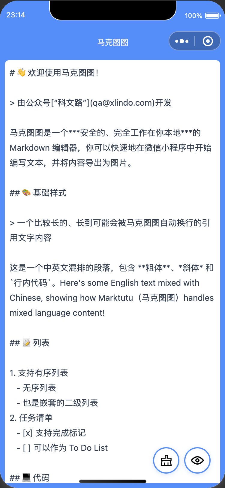

> 由公众号[“科文路”](qa@xlindo.com)开发

马克图图（MarkTutu）是一个***安全的、完全工作在你本地***的 Markdown 编辑器，你可以快速地在微信小程序中开始编写文本，并将内容导出为图片。

请打开微信扫一扫，扫描旁边的二维码访问。

## 示例截屏

## 更新

- 2025.2.23，版本 v1.0.0 上线小程序，完成大部分基础 MarkDown 语法渲染和图片下载功能

## 贡献

如果你有需要添加的内容，请整理好后联系我。

## 联系

- “科文路”公众号后台
- qr[at]xlindo.com